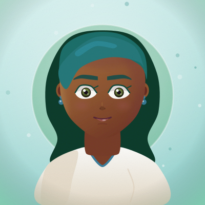
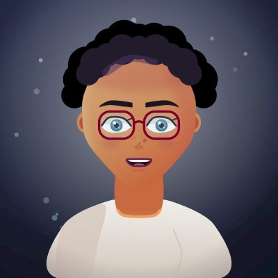
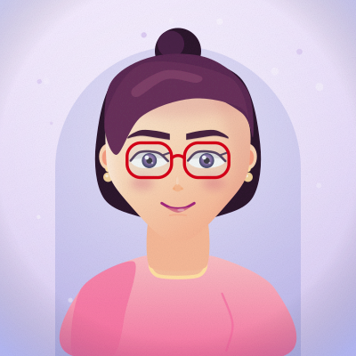
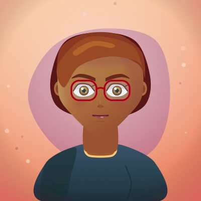

# rooshana

> ساخت کاراکتر SVG زیبا، **فقط با کد**. بدون فایل تصویری، بدون ادیتور، بدون وابستگی.

<p align="center">
  
  
  
  
</p>

هر کاراکتر از یک رشته‌ی **seed** ساخته می‌شود؛ همان seed همیشه همان کاراکتر را می‌دهد.

📖 **[راهنمای کامل: چطور کاراکتر SVG درجه‌یک بسازیم + کدام کتابخانه‌های گیت‌هاب](GUIDE.fa.md)**

---

## شروع سریع

```bash
npm test                    # ۱۷ تست، بدون هیچ وابستگی
node scripts/render.js --seed "Sara" --theme pastel --expression happy
node scripts/sheet.js 12    # گالری HTML → out/sheet.html
```

```js
import { createCharacter, withAnimation } from './src/index.js';

const { svg, spec } = createCharacter({
  seed: 'Sara',
  theme: 'lagoon',
  expression: 'happy',
  hairStyle: 'wavy',
  glasses: true,
});

document.body.innerHTML = withAnimation(svg); // با پلک زدن و تنفس
```

## گزینه‌ها

| گزینه | مقادیر | پیش‌فرض |
|---|---|---|
| `seed` | هر رشته‌ای | `'rooshana'` |
| `theme` | `sunlit` `midnight` `pastel` `forest` `slate` `ember` `lagoon` | از seed |
| `expression` | `calm` `happy` `focused` `surprised` `sly` | از seed |
| `hairStyle` | `short` `bob` `long` `wavy` `curly` `bun` | از seed |
| `skin` `hair` `eyeColor` `lip` `garment` | کد رنگ hex | از تم |
| `glasses` `freckles` `earrings` `blush` | `true` / `false` | از seed |
| `faceShape` `jaw` `eyeSpacing` `irisScale` | عدد ۰ تا ۱ | از seed |
| `size` | عدد (پیکسل) | `400` |
| `grain` | `true` / `false` | `true` |

هر گزینه‌ای که ندهی، به‌صورت **قطعی** از روی seed انتخاب می‌شود.

## ساختار

```
src/
  core/
    svg.js      موتور ساخت SVG (تگ، گرادیان، فیلتر، ماسک)
    path.js     منحنی‌های نرم با Catmull-Rom، تقارن، کمان
    color.js    HSL، سایه/هایلایتِ هنری، هارمونی رنگ
    rng.js      تصادفِ قطعی از روی seed (mulberry32)
  character/
    palettes.js  ۷ تم + پالت پوست/مو/چشم
    features.js  هر جزء = یک تابع خالص
    generate.js  ترکیب لایه‌ها
    animate.js   انیمیشن CSS داخل خود SVG
```

## نکات کلیدی

- **صفر وابستگی.** کل موتور SVG در ۱۵۰ خط.
- **قطعی بودن.** `createCharacter({seed:'x'})` همیشه بایت‌به‌بایت یکسان است.
- **idهای یکتا.** چند کاراکتر در یک صفحه با هم تداخل نمی‌کنند.
- **دسترس‌پذیر.** `role="img"` + `<title>`/`<desc>` + `prefers-reduced-motion`.
- **انیمیشن بدون JS.** فایل SVG حتی داخل `` هم پلک می‌زند.

## لایسنس

MIT
